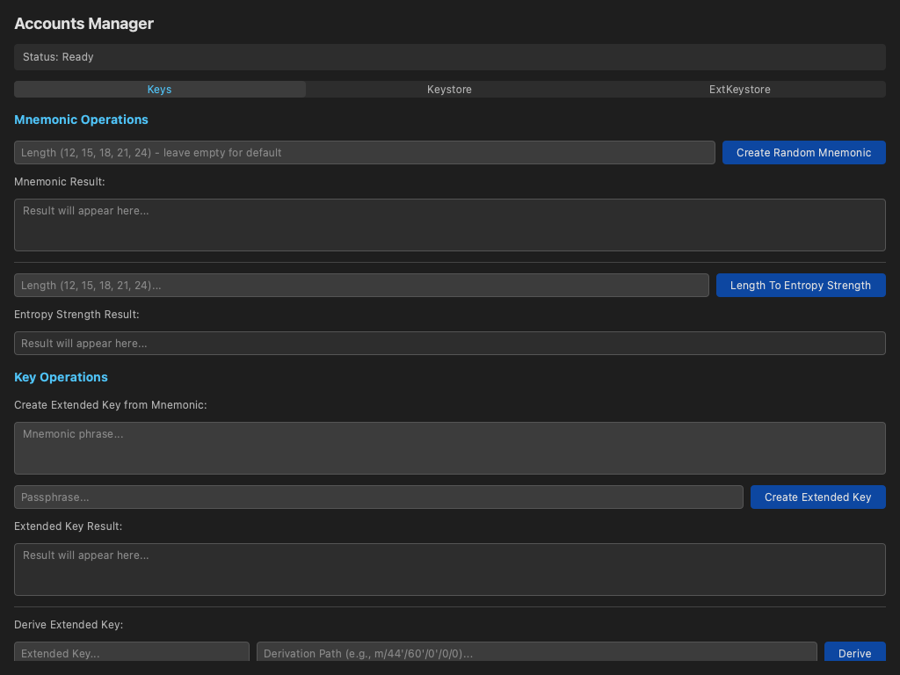
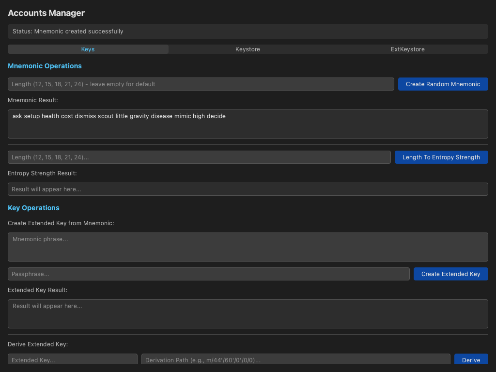
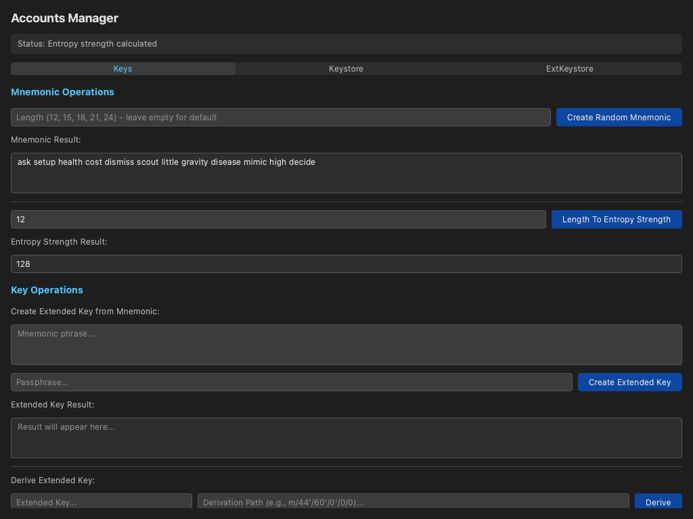

# Driving the Accounts UI Against This Module

The companion to the [headless runtime doc-test](accounts-module-runtime.md):
instead of calling `accounts_module` through the `logoscore` daemon, this one
drives the real **[`logos-accounts-ui`](https://github.com/logos-co/logos-accounts-ui)**
desktop app against **this** commit of the module.

`logos-accounts-ui` is a QML UI plugin built with
[`logos-app-builder`](https://github.com/logos-co/logos-app-builder), so its
flake exposes a standalone app (`apps.default`) that `nix run` launches in its
own window with all backend module dependencies bundled and auto-loaded. The
UI declares `accounts_module` as a flake input, so we build the app with an
`--override-input` that points that input at the commit under test. The UI then
talks to **this** module over the Logos IPC bridge, exactly as it would in
`logos-basecamp`.

The app is launched headless (`QT_QPA_PLATFORM=offscreen`) and driven through
the QML inspector via [`logos-qt-mcp`](https://github.com/logos-co/logos-qt-mcp):
we wait for elements to appear, type into inputs, click buttons, assert on the
results the module returns, and capture screenshots that are embedded in the
rendered tutorial and the CI report.

**What you'll build:** The `logos-accounts-ui` standalone app, built against this `accounts_module` commit and driven headlessly through its QML UI.

**What you'll learn:**

- How a UI built with `logos-app-builder` exposes a standalone `nix run` app
- How to override the UI's module input so it runs against a specific module commit
- How to drive a headless Qt/QML app with logos-qt-mcp (wait, type, click, assert)
- How to capture screenshots of the running UI for documentation and CI reports

## Prerequisites

- **Nix** with flakes enabled. Install from [nixos.org](https://nixos.org/download.html), then enable flakes:

```bash
mkdir -p ~/.config/nix
echo 'experimental-features = nix-command flakes' >> ~/.config/nix/nix.conf
```

Verify: `nix flake --help >/dev/null 2>&1 && echo "Flakes enabled"`

- **A Linux or macOS machine.** The app runs headless via `QT_QPA_PLATFORM=offscreen`, so no display is required.

---

## How the standalone UI app works

`logos-accounts-ui` is a QML UI plugin (`accounts_ui`) that declares
`accounts_module` as a dependency. Because it is built with
`logos-app-builder`, its flake's `apps.default` is a self-contained desktop
app:

```
+----------------------+   backend.createRandomMnemonic()   +-------------------+
|     accounts_ui      | --------------------------------->  |  accounts_module  |
|  AccountsView.qml    |   IPC (Logos API bridge)            |   C++ plugin      |
+----------------------+                                     +-------------------+
           ^                                                          ^
           └──────────────── bundled & launched by ───────────────────┘
                           logos-app-builder standalone app
```

The standalone app bundles every module dependency (here `accounts_module`)
and loads it automatically at startup — so when the QML calls
`backend.lengthToEntropyStrength(12)`, the call travels over the Logos bridge
to the real module and comes back with `128`. By overriding the
`accounts_module` input at build time we make that backend **this** commit.

## Step 1: Clone the UI

Clone [`logos-accounts-ui`](https://github.com/logos-co/logos-accounts-ui).
We clone over HTTPS so the step works in CI; over SSH the URL is
`git@github.com:logos-co/logos-accounts-ui.git`.

### 1.1 git clone

```bash
git clone --depth 1 https://github.com/logos-co/logos-accounts-ui.git
```

---

## Step 2: Build the qt-mcp test driver

[`logos-qt-mcp`](https://github.com/logos-co/logos-qt-mcp) is the harness the
doc-test uses to connect to the app's QML inspector and drive it. Build it
once and link it as `./result-mcp`.

### 2.1 Build logos-qt-mcp

```bash
nix build 'github:logos-co/logos-qt-mcp' -o result-mcp
```

---

## Step 3: Launch the UI and exercise the module

Launch the standalone app with `nix run`, overriding the `accounts_module`
input so the UI runs against **this** commit of the module. The doc-test
drives the running app: it waits for the UI to appear, generates a mnemonic,
and computes an entropy strength — each a real round-trip to `accounts_module`
over the Logos bridge.

> `` pins the override to the commit under test (the runner expands
> it: locally this checkout's `HEAD`, in CI the commit being tested). With no
> pin it falls back to the module's latest `master`.

### 3.1 Launch and drive the app

```bash
nix run ./logos-accounts-ui --override-input accounts_module github:logos-co/logos-accounts-module/a419d24945cbed127667a4a2a92770839294decb
```







Each interaction is a real call into **this** `accounts_module`:
clicking **Create Random Mnemonic** invokes
`accounts_module.createRandomMnemonic` (the returned phrase is random, so
we capture it in a screenshot rather than assert on it), and **Length To
Entropy Strength** with `12` returns exactly `128` (12 words → 128 bits of
entropy) — a deterministic, end-to-end proof the UI and this module talk
to each other. The captured screenshots are embedded above and in the CI
report.
